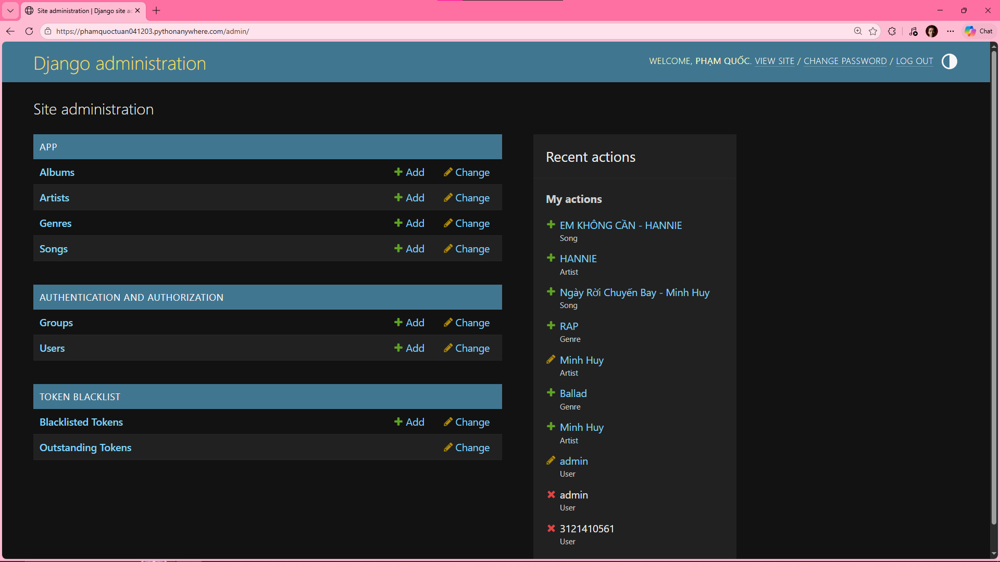
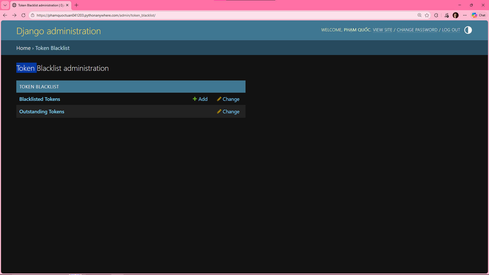
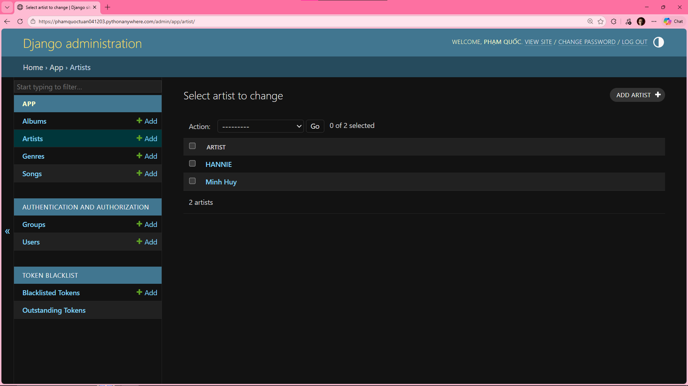
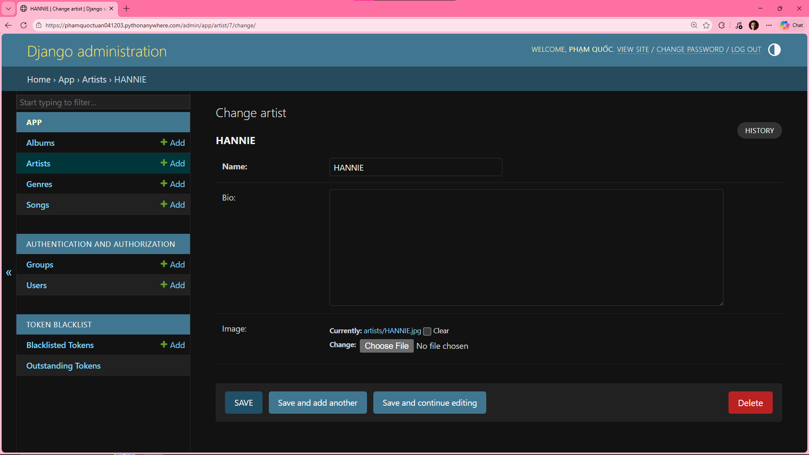
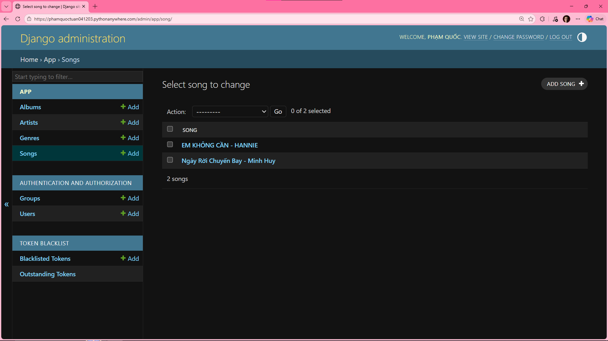
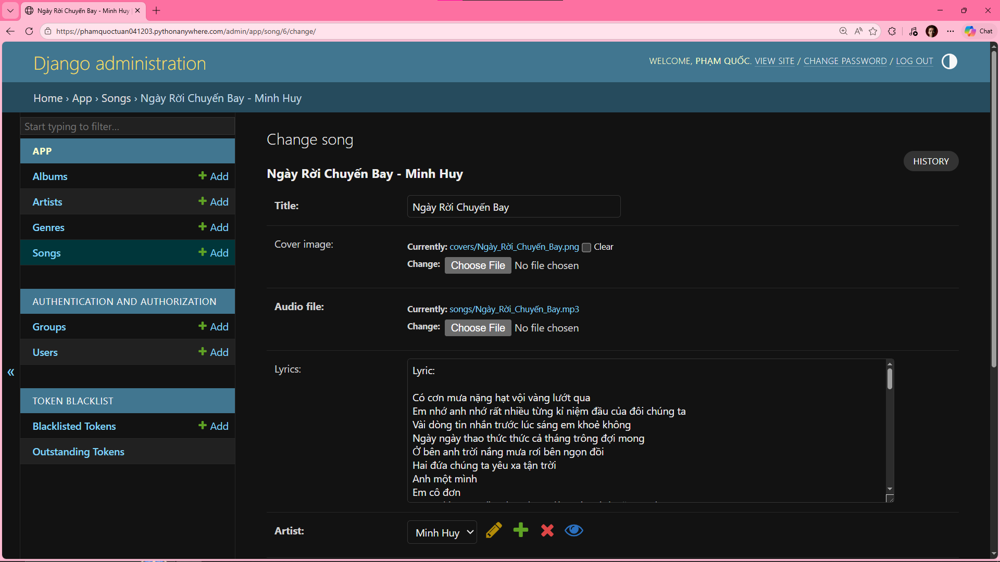
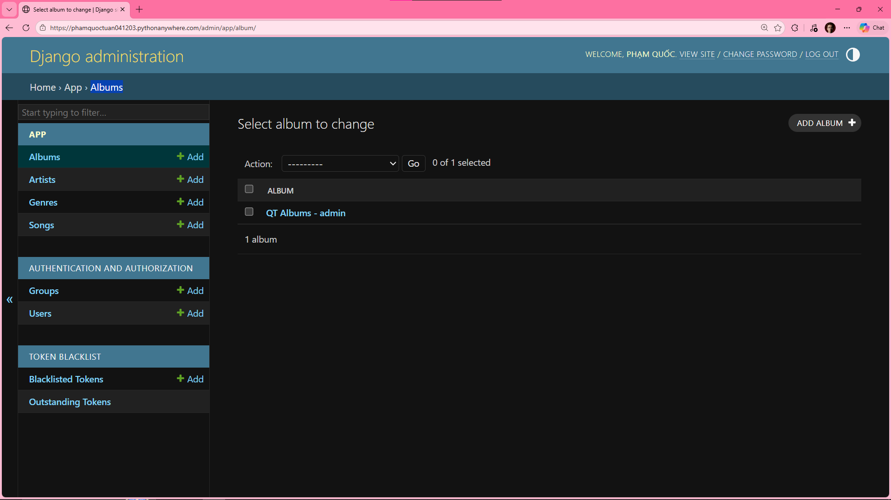
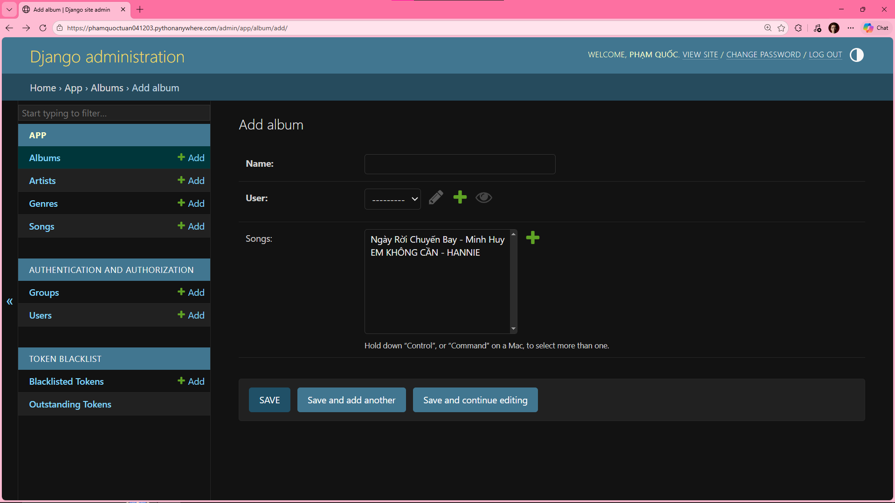
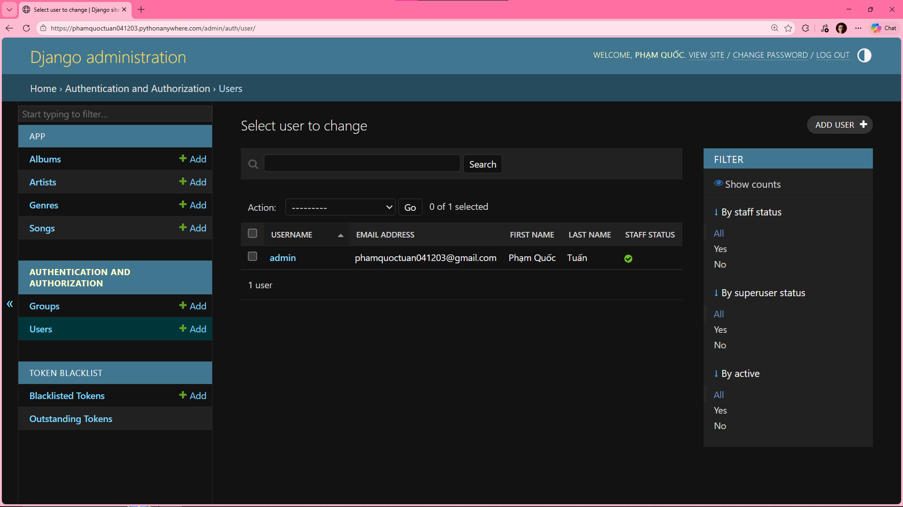
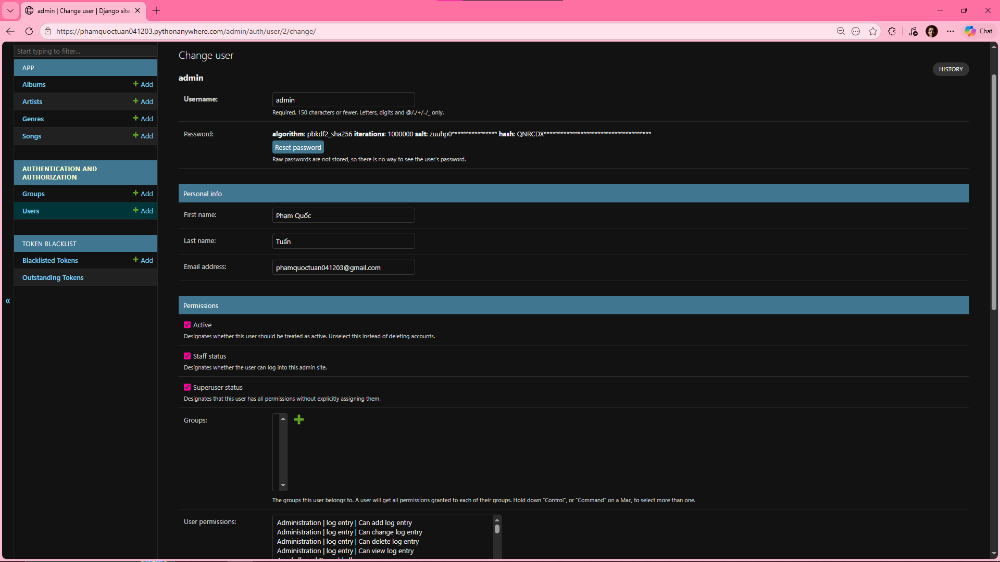

# 🎵 **M4U - Music Streaming Platform**

**Music Streaming Platform** lets users browse, play, and manage songs, favorite tracks, and personal albums. It supports authentication, artist and songs browsing, responsive audio player, search and filters.

Furthermore, it features a Admin Dashboard, providing administrators with control songs, albums, artist, genres, and user management through a secure, role-based access control (RBAC) system.

## 🌐 Deployment
- 🚀 **Web App**: [phamquoctuan041203.pythonanywhere.com](https://phamquoctuan041203.pythonanywhere.com/)
- 📖 **Django REST API**: [phamquoctuan041203.pythonanywhere.com/api](https://phamquoctuan041203.pythonanywhere.com/api/)

## 🛠️ Tech Stack
- ⚙️ **Backend**: Python 3 (Django REST Framework 5)
- 🔗 **ORM**: Django ORM
- 🗄️ **Database**: MySQL Workbench 8
- 🔐 **Authentication**: Django Session + Simple JWT
- 📄 **API Documentation**: Django REST Framework API
- 🎨 **Frontend**: HTML5, CSS3, Bootstrap5, JavaScript
- 🌈 **Icons**: Bootstrap Icons

## ✨ Features

### 👤 Customer
- **Smart Streaming:** High-quality audio playback with auto-play next track logic.
- **Library Management:** Personalize experience with Favorites and Custom Albums.
- **Discovery:** Browse latest releases, artist profiles, and detailed track insights.
- **Advanced Search:** Quick navigation with smart filtering by songs and artists.

### 👨‍💼 Admin Panel (Django Admin)
- **Authorization:** Secure RBAC (Role-Based Access Control).
- **Catalog:** Full CRUD Songs, Users, Genres, Artists, Albums.
- **Users:** Account oversight and security credential resets.
- **Token:** Management Outstanding Token and Blacklisted Token.

### 🖥️ Admin Interface
<details>
<summary><b>🔍 Click to see Admin Screenshots</b></summary>

| Dashboard | Token Management |
|:---:|:---:|
|  |  |
| Artists Management | Artist Update |
|  |  |
| Songs Management | Song Update |
|  |  |
| Albums Management | Album Update |
|  |  |
| Users Management | User Update |
|  |  |

</details>

## API Endpoints

### Auth API (`/api/auth`)
- `POST /register` — Register user
- `POST /login` — Login (get JWT tokens)
- `POST /refresh` — Refresh access token
- `POST /logout` — Logout (blacklist refresh token)
- `GET /profile` — Get user profile

### Search API (`/api/search`)
- `GET /api/search/?query=<strings>&genre=<id>` — Search songs

### Songs API (`/api/songs`)
- `GET /` — List songs
- `GET /{id}` — Song detail
- `GET /api/songs/favorites/` — List favorite songs ``JWT token``
- `POST /api/songs/{id}/favorite/` — Toggle favorite ``JWT token``

### Artists API (`/api/artists`)
- `GET /` — List artists
- `GET /{id}` — Artist detail

### Genres API (`/api/genres`)
- `GET /` — List genres 
- `GET /{id}` — Genre detail 

### Albums API (`/api/albums`) - ``JWT token``
- `GET /api/albums/` — List my albums
- `POST /api/albums/` — Create album
- `GET|PUT|DELETE /api/albums/{id}/` — Album CRUD
- `POST /api/albums/{album_id}/songs/{song_id}/add/` — Add song to album
- `DELETE /api/albums/{album_id}/songs/{song_id}/remove/` — Remove song from album

### Admin API (`/api/admin`) - ``JWT token``
- `GET|POST /songs` — Song CRUD
- `GET|POST /artists` — Artist CRUD
- `GET|POST /genres` — Genre CRUD

## 🏗️ Solution Structure
```text
Music-4U/
├── source/                      # Root directory for Django source code
│   ├── app/                     # 🎵 Core application logic (Models, Views, Serializers)
│   ├── project/                 # ⚙️ Project settings & configurations (settings.py, urls.py)
│   ├── media/                   # 📂 User-uploaded audio files & images (Git ignored)
│   ├── static/                  # Frontend assets (CSS, JavaScript, Images)
│   ├── templates/               # HTML interface components
│   ├── .env                     # 🔐 Private environment variables
│   ├── manage.py                # Administrative command-line utility
│   └── requirements.txt         # Project dependencies
└── README.md                    # Project documentation
```

## 🚀 Setup & Run Locally

### 1) 📥 Clone
```bash
git clone https://github.com/quoctuan-IT/Music-4U.git
cd Music-4U
cd source
```

### 2) ⚙️ Configure Virtualenv and Install
```bash
python -m venv venv
venv\Scripts\activate
pip install -r requirements.txt
```

### 3) 🔄 Migrate Database
```bash
python manage.py makemigrations
python manage.py migrate
python manage.py createsuperuser
```

### 4) 🐞 Debug and Run
```bash
python manage.py runserver
```

### 5) 🌍 Access
- MVC: `https://localhost:<port>/`
- ADMIN: `https://localhost:<port>/admin`
- API: `https://localhost:<port>/api`

## 🧪 Quick API Test Flow `(Django REST API)`
```bash
# Register
curl -X POST http://127.0.0.1:8000/api/auth/register/ \
  -H "Content-Type: application/json" \
  -d '{"username":"test","password":"pass123","email":"test@example.com"}'

# Login
curl -X POST http://127.0.0.1:8000/api/auth/login/ \
  -H "Content-Type: application/json" \
  -d '{"username":"test","password":"pass123"}'

# Response
Response:{"access": "<ACCESS_TOKEN>","refresh": "<ACCESS_TOKEN>"}
# Use <ACCESS_TOKEN> for authenticated requests
```

```bash
curl http://127.0.0.1:8000/api/songs/ \
  -H "Authorization: Bearer <ACCESS_TOKEN>"

# "Refresh" token when access token "Expires"
curl -X POST http://127.0.0.1:8000/api/auth/refresh/ \
  -H "Content-Type: application/json" \
  -d '{"refresh": "<REFRESH_TOKEN>"}'

# Toggle favorite song
curl -X POST http://127.0.0.1:8000/api/songs/1/favorite/ \
  -H "Authorization: Bearer <ACCESS_TOKEN>"

# Create album
curl -X POST http://127.0.0.1:8000/api/albums/ \
  -H "Authorization: Bearer <ACCESS_TOKEN>" \
  -H "Content-Type: application/json" \
  -d '{"name":"My Favorites"}'
```

## 📝 Notes
Media (images, audio files) are saved at: `source/media/`.

<div align="center">
    <br />
    <svg width="100%" height="10" xmlns="http://www.w3.org/2000/svg">
        <defs>
            <linearGradient id="grad1" x1="0%" y1="0%" x2="100%" y2="0%">
                <stop offset="0%" style="stop-color:#092e20;stop-opacity:1" /> <stop offset="100%" style="stop-color:#3776ab;stop-opacity:1" /> </linearGradient>
        </defs>
        <rect width="100%" height="4" fill="url(#grad1)" rx="2" />
    </svg>
    <br />
    <p align="center">
        
        
        
        
    </p>
    <p>
        💻 Developed by <strong style="color: #3776ab;">Phạm Quốc Tuấn</strong> ❤️<br/>
        🎓 <strong>IT - Saigon University (SGU)</strong>
    </p>
    <p>
        <a href="https://github.com/quoctuan-IT">
            
        </a>
    </p>
    <p style="color: #888; font-size: 0.85rem;">
        &copy; 2026 Music Streaming Project. All rights reserved.
    </p>
</div>